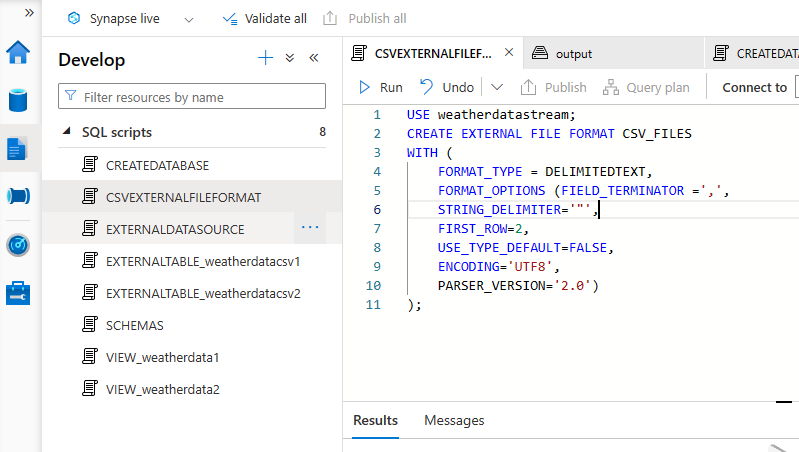

# web-weather-scraping-data-engineering-project
Creating ...
datastream.py

Creating Event Hub 

Creating Stream Analytics job

Adding input to stream analytics job

Creating storage account for output

Adding output to stream analytics job

Starting stream analytics job...

Creating synapse analytics

Connect to external data in azure synapse analytics

Creating Database

Creating external file format

Creating external data source

Creating Schemas

Creating Views BY providing json file names in bulk

Creating External tables

You can now see csv files in ADLS

